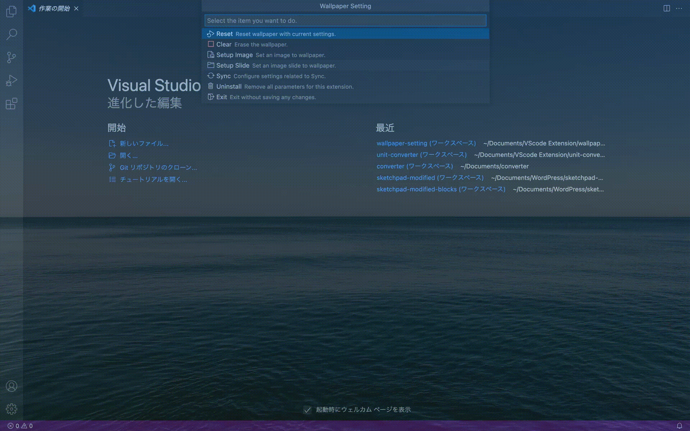
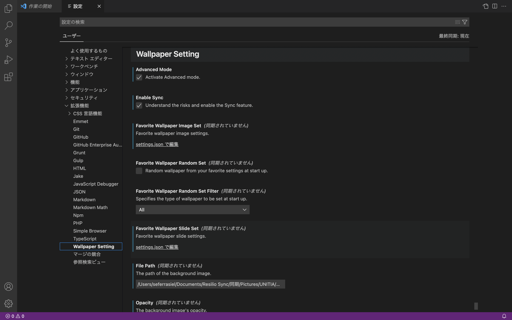
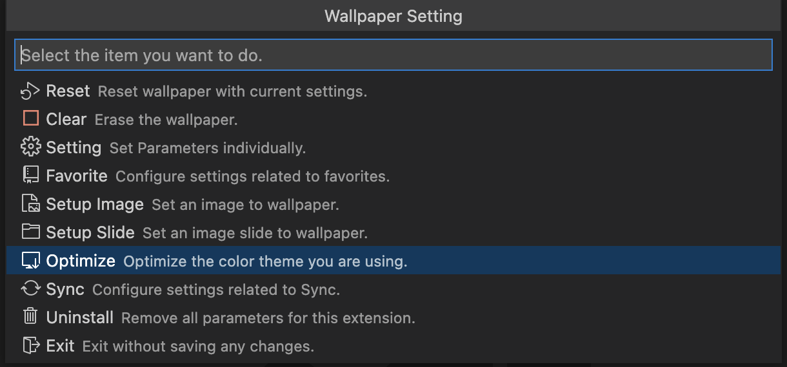
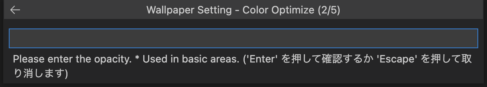
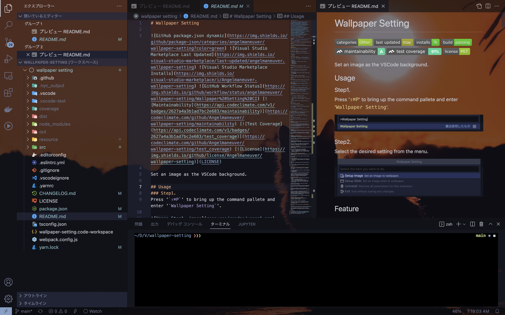
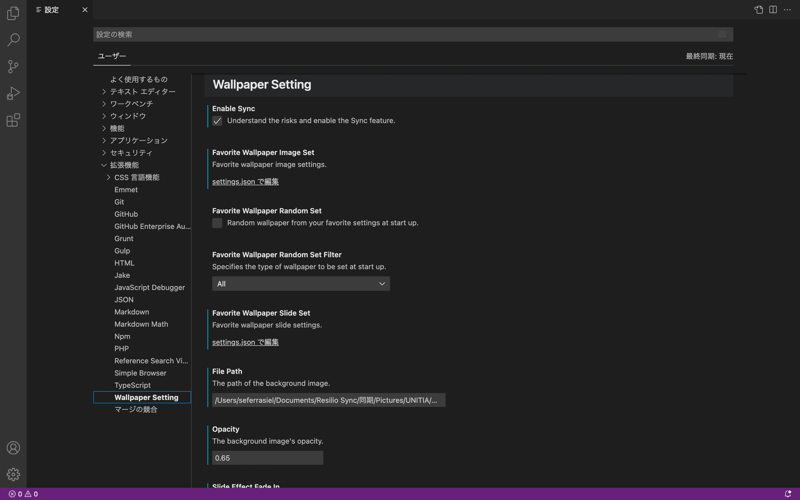

# Wallpaper Setting

      

Set an image as the VSCode background.

## Usage
### Step1.
Press '`⇧⌘P`' to bring up the command pallete and enter '`Wallpaper Setting`'.

### Step2.
Select the desired setting from the menu.

## Feature
### Easy Setup
Just follow the guide to easily set the wallpaper.

### Wallpaper - Image
You can set an image as the VSCode background.

Setting items
 - Opacity

### Wallpaper - Slide
You can set a slide image as the VSCode background.

Setting items
 - Opacity
 - Slide Interval Time (Hour, Minute, Second, MilliSecond)
 - Random Play
 - Fade-in Effect

### Favorite
Do you have many favorite images or slides?

You can easily switch between them using the Favorite Setting.

***Don't repeat yourself!*** with this features.

Setting items
 - Set wallpaper from favorite settings randomly when starting VSCode

### Sync
Are you developing on multiple machines?

***You no longer need to hand out image!*** with this features.

#### Upload
First, upload the wallpaper settings you wish to Sync.

#### Download
Next, download and setup the wallpaper settings on another machines.

#### Delete
Want to delete your uploaded wallpaper settings?

Of course you can turn it delete. Just go to the menu and click on "Delete" or "Uninstall" and your uploaded wallpaper settings will be gone!

#### Warning
***Please check the details in the Cautions section.***

\* This feature is disabled by default

\* Only Wallpaper - Image setting can be Sync

\* Image file size is less than 500KB, it can be used for Sync

\* VSCode standard feature "Settings Sync" must be enable

### Uninstall
Didn't like this extension?

Sorry for not being able to help you.

Let's uninstall it and erase all settings related to this extension.

It won't pollute your environment.

## Advanced Mode
You want to set only the background, but you are not happy that even the text is transparent?

I understand! Let's resolve your complaint.

However, it will take some labor to resolve your complaint.

Also maybe it will not work.

Only those who understand this should use this feature.

## Step1.
Advanced Mode requires the json file of the color theme you are using.

If it is a color theme installed from extension, it is quicker to change the file extension of the vsxi file download from marketplace to zip, unzip it, and get it from the theme folder.

We are not sure about the default theme is, so please investigate on your own.

## Step2.

From the VSCode settings screen, check the "Advanced Mode" checkbox in the Wallpaper Setting to enable the feature.

## Step3.
### Calling Wallpaper Setting

Invoke Wallpaper Setting from the command palette and select the `Optimize`.

### Enter the Color Theme name

First, the name of color theme you are using will be displayed, so please make sure it is the same. If it is different, please enter the corrent name.

### Enter the transparency

Next, enter the three types of transparency.
 - Base : Transparency used in basic areas
 - Overlap : Transparency used in overlapping areas
 - Selection : Transparency used in areas that shoud not be transparent

### Enter the Color Theme json file path

Finally, enter the json file path of the Color Theme you prepared.

### About Optimize
 - This process is required once per Color Theme unit
 - Optimized Color Theme information will be added to settings.json

## Step4.
After that, please proceed as usual setting from the menu.

In Advanced Mode, transparency settings can only be set when `Optimize`.

## Cautions
### How will this extension affect your environment?
This extension will make changes to the following three files.

1. "VSCode installation directory" /resources/app/out/bootstrap-window.js
1. settings.json
1. extensions.json (Only when using the Sync feature)

"bootstrap-window.js" requires write permission.
Therefor, this extension cannot be used with VSCode installed from "Snap Store" App Store for Linux (Because write permission cannot be granted).

### About Sync Feature
You probably have the following questions about Sync feature.
 - Why is it disabled by default?
 - Why can't Sync Wallpaper - Slide settings?
 - Why is there a limit of 500KB file size or less?
 - Will the upload images seen by the Setting Sync Administrator?

To answer thees questions, we must first briefly describe the Sync feature.

The Sync feature is achieved by converting image data to strings in Base64 and sharing them via Settings Sync.

Settings Sync backend is probably provided by Microsoft. And definitely not intended for image data sharing.

If you try to share an image file over MB (maybe even KB) with Settings Sync, ***Microsoft will be offended***. They will reject the this extension and possibly ***disable the account of the user using the this extension from Settings Sync***.

this is the reason why it is disabled by default and why limit is set.

### About image data to be uploaded
The Base64 string uploaded to Settings Sync is encrypted in AES256 CTR mode.

Therefore, there is no fear of prying eye.

Unless you use poor values for password and salt, or I have made a mistake in the implementation of the cryptographic call.

### If use the Sync feature with an understanding of the risks

From the VSCode settings screen, check the "Enable Sync" checkbox in the Wallpaper Setting to enable the feature.

## Support

