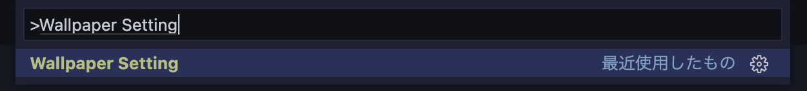
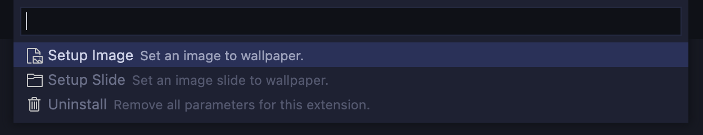

# Wallpaper Setting

Set an image as the VSCode background.

## Usage

1. Press '⇧⌘P' to bring up the command pallete and enter 'Wallpaper Setting'

2. Select the desired setting from the menu

## Implementation schedule

- [x] Reconfigure only some of the settings
- [x] Retain recently set content
- [x] Random playback of slides * May not be done due to lack of skills.
- Break Mode * May not be done due to lack （ry
- Display the time * May not be done due （ry
