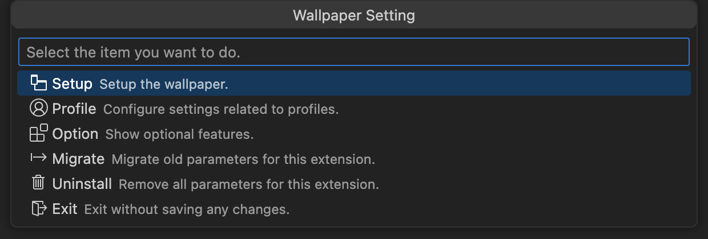
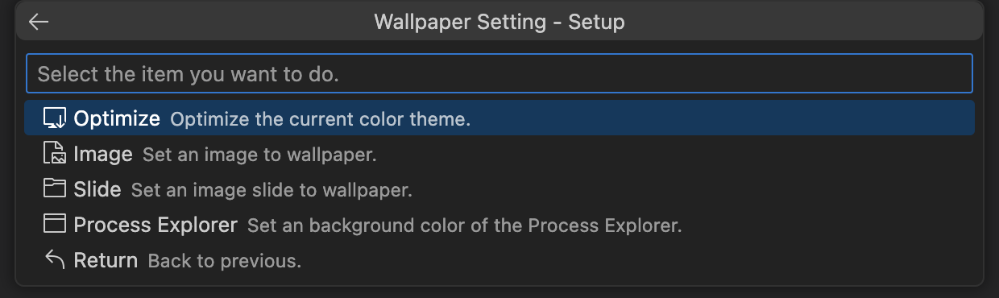
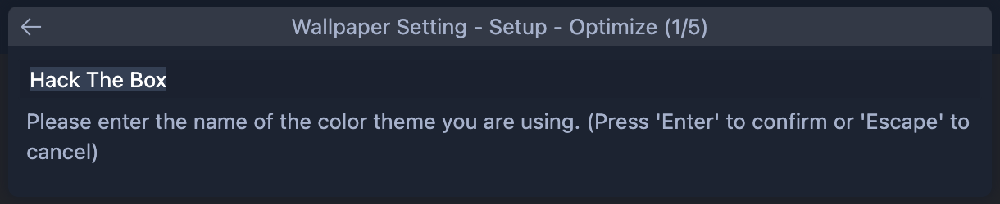
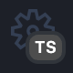

	<h1>Wallpaper Setting</h1>
	
Set an image as the VSCode background.

	

		
		
		
		
	

## New feature

1. Color theme optimize of some parts can now be set individually

\* Once a color theme is optimize, it can be set individually.

Click here to see the new feature.

1. Added the ability to on demand change image for wallpaper

Click here to see the new feature.

## Good news !

  

    This extension provides VSCode with only the background transparent.
  

  

    Text and images will never be blurred.
  

  

    You can concentrate on your creative work by preparing for images.
  

  

    We have been researching VSCode for a long time and have finally found a way to get the color information of a theme. *
  

  

    You no longer need to prepare json files for the theme you are using.
  

  

    * The default theme is also supported.
  

## Warning

1. In the near future, we will discontinue the migration function for obsolete parameters prior to version 1.0.0.

1. In the near future, we will discontinue the profile feature (because the on demand feature allows you to set the wallpaper for each profile)

## Usage

Press `⇧⌘P` to bring up the command pallete and enter '`Wallpaper Setting`', and select the `Setup`.

Select the `Optimize`.

Enter the three types of transparency.

This completes the required work to use this extension, please select and execute the necessary setting form the menu.

This process is required once per Profile or once per Theme.

Optimized Color Theme information will be added to profile's `settings.json`.

Once a color theme is optimize, it can be set individually.

Click here to see the new feature.

## Feature

### Wallpaper - Image

You can set an image as the VSCode background.

Click here to see the parameter detail.

| Name     | Required | Description                                    | Remark |
| :------- | :------: | :--------------------------------------------- | :----- |
| FilePath |    ○     | Path of the file to be used for the wallpaper. |        |

### Wallpaper - Slide

You can set a slide as the VSCode background.

Click here to see the parameter detail.

| Name               | Required | Description                                                 | Remark                                                                        |
| :----------------- | :------: | :---------------------------------------------------------- | :---------------------------------------------------------------------------- |
| FilePaths          |    ○     | Path of the files to be used for the slide.                 |                                                                               |
| Interval Time      |    ○     | Image switching time. (Hour, Minute, Second, MilliSecond)   |                                                                               |
| Randome Play       |    -     | Randomize image switching.                                  | Default False.                                                                |
| Effect Fade in     |    -     | Display Fade in effect when switching images.               | Default True.                                                                 |
| Load wait complete |    -     | Wait for the screen to display until all images are loaded. | Default False.   Depending on the images file size, startup may be slow. |

### Wallpaper - Movie

You can set an movie as the VSCode background.

\* Mute is a specification.

Click here to see the parameter detail.

| Name          | Required | Description          | Remark       |
| :------------ | :------: | :------------------- | :----------- |
| Playback Rate |    ○     | Movie playback rate. | Default 1.0. |

### Favorite

Do you have many favorite images or slides?

You can easily switch between them using the Favorite Setting.

**_Don't repeat yourself!_** with this features.

Click here to see the parameter detail.

| Name     | Required | Description                                                               | Remark |
| :------- | :------: | :------------------------------------------------------------------------ | :----- |
| Start Up |    -     | Set a random background from the favorite settings when VSCode starts up. |        |

#### On demand

You can switch images without having to install your favorite images each time.

\* Only favorite images.

Click here to see the parameter detail.

### Profile (deprecated)

Wallpaper can be set for each profile.

It is easier to see what profile you are currently using.

Click here to see more detail.

This feature allows you to set a wallpaper for profile.

#### Attention

When registering a profile, enter the two letters of the profile badge shown in the lower left corner of the VSCode, not the full name of the profile.

\* In the case of the example in the image, enter the `TS`.

Then, after registering the profile, run `Set` or `Reset`.

### Watermark

You can change the image of VSCode watermark.

Then, after set the watermark setting, run `Set` or `Reset`.

### WebSocket

By preparing a [dedicated server](https://github.com/Angelmaneuver/fortune-slip), wallpaper can be set via WebSocket.

otherwise, an application that sends image data when a client makes a WebSocket connection can be substituted.

\* Please use only trusted server as we can't verify delivery data.

Click here to see more detail.

#### Q&A

Q. Why WebSocket instead of http ?

A. VSCode only allows http**s** and ws in **C**ontent **S**ecurity **P**olicy

### Sync

Are you developing on multiple machines?

**_You no longer need to hand out image!_** with this features.

Click here to see more detail.

#### Upload

First, upload the wallpaper settings you wish to Sync.

#### Download

Next, download and setup the wallpaper settings on another machines.

#### Delete

Want to delete your uploaded wallpaper settings?

Of course you can turn it delete. Just go to the menu and click on `Delete` or `Uninstall` and your uploaded wallpaper settings will be gone!

#### Warning

The Sync feature is achieved by converting image data to strings in Base64 and sharing them via Settings Sync.

Settings Sync backend is probably provided by Microsoft. And definitely not intended for image data sharing.

If you try to share an image file over MB (maybe even KB) with Settings Sync, **_Microsoft will be offended_**. They will reject the this extension and possibly **_disable the account of the user using the this extension from Settings Sync_**.

If you use it, please take its dangers into consideration.

#### About image data to be uploaded

The Base64 string uploaded to Settings Sync is encrypted in AES256 CTR mode.

Therefore, there is no fear of prying eye.

Unless you use poor values for password and salt, or I have made a mistake in the implementation of the cryptographic call.

### Uninstall

Didn't like this extension?

Sorry for not being able to help you.

Let's uninstall it and erase all settings related to this extension.

It won't pollute your environment.

## Environment Variables Support

Environment variables can be used in the path that specifies the image file.

Click here to see more detail.

| Notation                          | Description                                                                          | Remark                                          |
| :-------------------------------- | :----------------------------------------------------------------------------------- | :---------------------------------------------- |
| ${userHome}                       | Returns the string path of the current user's home directory.                        | Implementation-wise, we use node.js os.homedir. |
| ${\<Environment Variables Name\>} | If the environment variable specified in $\{~\} exists, it is replaced by its value. |                                                 |

## Required

### Write permission

This extension modifies the following files in the VSCode installation directory, so requires write permission.

1. /Resources/app/out/vs/code/electron-sandbox/workbench/workbench.js
1. /Resources/app/out/vs/code/electron-sandbox/processExplorer/processExplorer.js (Only when setting the background color for Process Explorer)

Therefor, this extension cannot be used with VSCode installed from "Snap Store" App Store for Linux (Because write permission cannot be obtained).

## Caution

### How will this extension affect your environment ?

This extension modifies the following files in the VSCode installation directory.

1. /Resources/app/out/vs/code/electron-sandbox/workbench/workbench.js
1. /Resources/app/out/vs/code/electron-sandbox/processExplorer/processExplorer.js (Only when setting the background color for Process Explorer)

and following files.

1. settings.json
1. extensions.json (Only when using the Sync feature)

### You will be warned that it is not supported

Prior to VSCode 1.72, the relevant message was not displayed.
In fact, it is more correct to display.

[The official explanation of this message is roughly as follows.](https://code.visualstudio.com/docs/supporting/faq#_installation-appears-to-be-corrupt-unsupported)

> We are not trying to block VS Code patching, but we want to raise awareness that patching VS Code means you are running an unsupported version.

Respecting this assertion, this extension makes no attempt to prevent such messages from being displayed.

Even if we were to prevent it from being displayed, I believe the officials will block it.

## External libraries used by this extension

1. [vscode/l10n](https://github.com/microsoft/vscode-l10n)
1. [jsonc-parser](https://github.com/microsoft/node-jsonc-parser)
1. [clean-css](https://github.com/clean-css/clean-css)
1. [terser](https://github.com/terser/terser)
