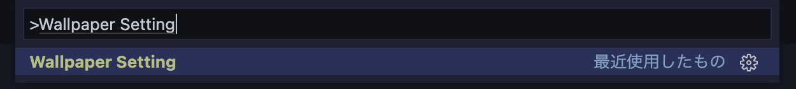
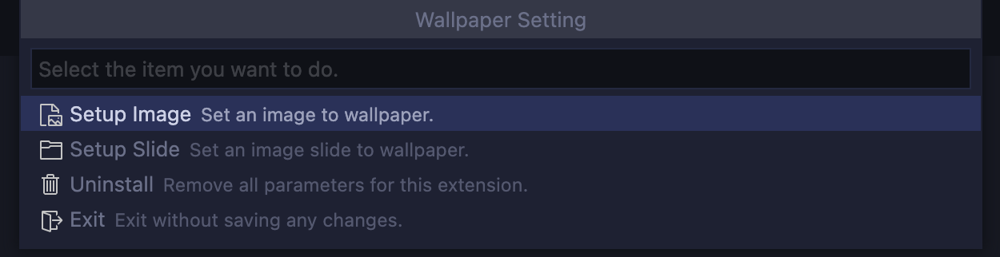

# Background Image Setting

Set an image as the VSCode background.(forked from https://github.com/Angelmaneuver/wallpaper-setting)

## Usage
### Step1.
Press '`⇧⌘P`' to bring up the command pallete and enter '`Wallpaper Setting`'.

### Step2.
Select the desired setting from the menu.

## Feature
### Easy Setup
Just follow the guide to easily set the wallpaper.

### Wallpaper - Image
You can set an image as the VSCode background.

Setting items
 - Opacity

### Wallpaper - Slide
You can set a slide image as the VSCode background.

Setting items
 - Opacity
 - Slide Interval Time (Hour, Minute, Second, MilliSecond)
 - Random Play
 - Fade-in Effect

### Favorite
Do you have many favorite images or slides?

You can easily switch between them using the Favorite Setting.

***Don't repeat yourself!*** with this features.

Setting items
 - Set wallpaper from favorite settings randomly when starting VSCode

### Uninstall
Didn't like this extension?

Sorry for not being able to help you.

Let's uninstall it and erase all settings related to this extension.

It won't pollute your environment.

## Cautions
### How will this extension affect your environment?
This extension will make changes to the following two files.

1. "VSCode installation directory" /resources/app/out/bootstrap-window.js
1. settings.json

"bootstrap-window.js" requires write permission.
Therefor, this extension cannot be used with VSCode installed from "Snap Store" App Store for Linux (Because write permission cannot be granted).
